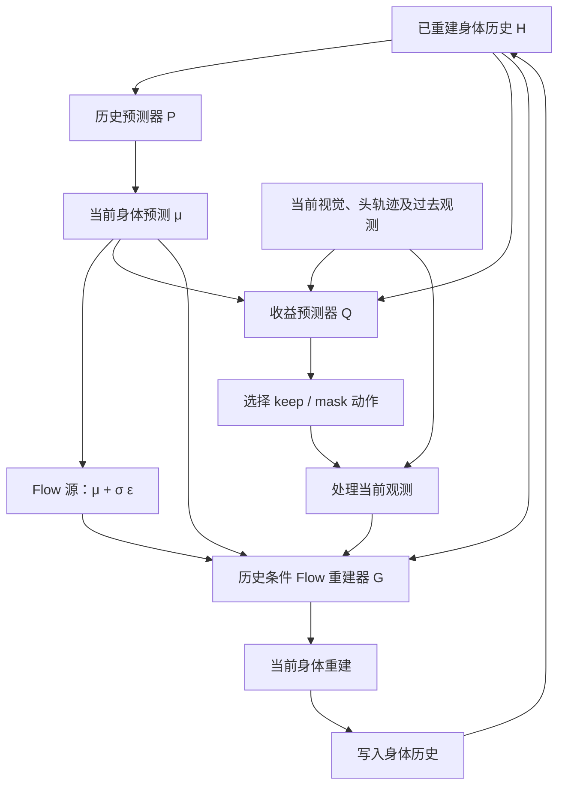

# EgoRecover：历史先验与收益引导的 Flow 人体运动重建方案

日期：2026-09-22。状态：研究与实施方案，尚无本方案的实验结果。沿用已有项目名 **EgoRecover**。

本文依据已确认的架构展开：**一个历史预测器、一个收益预测器、一个历史条件 Flow 重建器。** 原有[数据集设想](../archive/iccv2027-draft.md)保持不变；本文承接其中的错配类型和干净启动设定，给出新的方法主线。旧文档中冻结生成器、先生成全部候选再选择、历史释放等设计属于此前版本，不是本文首版系统。

方法依托用户 [UEM-update / e7-codebase](https://github.com/sxh-kk/UEM-update/tree/e7-codebase)。本地代码核验提交为 `03d0202c0d21514b644f6db8453e2ad5ac69c0f2`；权重、数据与运行环境由用户准备。本次仅新增文档，没有修改模型代码或原方案。

采用 [CCFA-Skills](https://github.com/mikubaka88/CCFA-Skills) 的文献检索、idea-optimizer、实验设计流程，按“问题—机制—证据”组织。18 项来源、核验范围与发表状态见配套文献调研（原工作区 `../output/literature-search/egorecover-history-flow/papers.md`，本仓库未收录）。文中“拟采用/建议/待验证”均为本项目设计，不是引用论文已经证明的结论。

## 1. 方案要解决什么

**在视频与头轨迹最初正常、随后发生局部或持续错配的情况下，利用已重建身体历史判断当前应该采用哪些观测，并重建当前人体运动。** 目标是降低身体重建误差，尤其是故障期间的误差与观测恢复后的残留误差。

这里的历史始终是此前输出的身体状态，而不是把历史视频或头轨迹当作正确身体。方法以干净启动得到的有效身体历史为工作前提，持续把自己的重建写入缓存。训练可以使用身体真值监督；正式测试使用预测历史，不在故障开始或结束时用真值重置。

三个模块各回答一个问题：

| 模块 | 回答的问题 | 作用 |
|---|---|---|
| 历史预测器 P | 只看已经重建的身体，当前大概应该是什么动作？ | 输出当前身体预测 μ，提供运动先验 |
| 收益预测器 Q | 保留、屏蔽哪种观测，会让当前身体重建更准确？ | 在运行重建器之前选择观测处理动作 |
| Flow 重建器 G | 从历史给出的预测出发，结合选中的当前观测，如何得到当前身体？ | 对当前身体进行生成式修正 |

这对应最初的三个问题：

1. **如何判断失真：** 首版不要求先输出“哪个传感器坏了”的硬结论，而是利用时序、跨模态与身体兼容性证据，预测处理动作的收益。
2. **修正还是屏蔽：** 首版显式动作是保留/屏蔽；修正发生在身体重建阶段。延迟估计、轨迹去漂移等传感器修复属于后续可增加的动作。
3. **如何引入历史：** 历史同时用于预测当前身体、解释当前观测、约束 Flow 的时间上下文。

准确的历史并不意味着当前预测 μ 必然准确。例如人可以突然转身或停下；正因为 μ 是预测，当前观测仍然有价值，G 必须能对 μ 作出足够大的修正。

## 2. 从相关工作借鉴什么

### 2.1 直接决定架构的来源

| 设计位置 | 参考来源与已有机制 | 本项目的采用方式 | 必须由本项目验证的内容 |
|---|---|---|---|
| 已重建身体作为在线上下文 | [EgoForce，§3](https://arxiv.org/html/2605.13041v1)；[HMD²，§3.2](https://arxiv.org/html/2409.13426v2) | 将身体历史作为已知上下文，只生成当前帧 | 对延迟、冻结、漂移是否仍有重建收益 |
| 历史预测＋噪声作为源 | [WarmPrior，§3](https://arxiv.org/html/2605.13959v1) | 用 P(H) 预测当前身体，源设为 μ＋σε | 相同历史条件下，改变源分布是否优于高斯源 |
| 预测源与训练对齐 | [Sequential Flow Matching，§3.4](https://arxiv.org/html/2602.05319v1) | 用模型预测作源、身体标注作目标，训练与推理使用一致构造 | 训练得到的修正器能否适应连续回放 |
| 预测与修正分阶段训练 | [PrediFlow，§III](https://arxiv.org/html/2512.13903v1) | P 先训练并冻结，再训练 G | P＋G 是否优于 P 单独输出 |
| 单独和联合处理的收益 | [CMA，Modality Attribution](https://arxiv.org/html/2608.00076v2)；[Sample-level Modality Valuation](https://openaccess.thecvf.com/content/CVPR2024/html/Wei_Enhancing_Multimodal_Cooperation_via_Sample-level_Modality_Valuation_CVPR_2024_paper.html) | 四动作构成可枚举的价值表，训练直接收益回归 | 收益能否在不运行候选 G 的情况下预测 |
| 错配基准的结构 | [MultiCorrupt](https://arxiv.org/html/2402.11677v2)；[Robust-Ego3D](https://arxiv.org/html/2501.14319v1)；[Temporal Corruption](https://arxiv.org/html/2403.20254v1) | 单项/组合故障、固定强度、局部事件、同源 clean 配对 | 是否揭示现有重建器稳定、可重复的失效模式 |

这些是机制借鉴，不是把几篇论文的系统完整拼接。首版没有 EgoForce 的未来潜变量缓冲区，没有 WarmPrior 的双长度动作块，也没有 SFM 的完整分布式滤波表示。

### 2.2 必须承认的已有覆盖

“历史相关源分布”已有机器人、时序预测和人体运动工作；特别是 [TSFlow](https://proceedings.iclr.cc/paper_files/paper/2025/hash/ee1a1ecc92f35702b5c29dad3dc909ea-Abstract-Conference.html) 与 [Gaussian-Mixture Latent Flow 的 §5.2](https://arxiv.org/html/2608.21093v1)。逐帧 forcing 与 Flow 的人体运动结合也已有 [FloodDiffusion](https://arxiv.org/html/2512.03520v2)。因此不能把“历史作为 Flow 起点”或“把 diffusion 改为 Flow”作为唯一创新。

“检测坏模态，再拒绝或补偿”已有 [Detect, Reject, Correct](https://arxiv.org/pdf/2012.00201)；跨模态一致性门控已有 [Single-Source Adversaries](https://openaccess.thecvf.com/content/CVPR2021/html/Yang_Defending_Multimodal_Fusion_Models_Against_Single-Source_Adversaries_CVPR_2021_paper.html)。本项目要比较的是：**在给定身体历史与生成器的情况下，直接学习处理动作的身体重建收益，是否比故障检测后按规则选择更有效。**

### 2.3 建议保留的论文主张

拟验证三个主张，而不是现在宣称三个贡献已经成立：

- **问题与协议：** 正常启动后发生的多模态错配，需要同时评估故障中的重建与输入恢复后的表现；静态受损窗口均值不足以描述这个过程。
- **方法：** 身体历史提供与当前观测不同的运动上下文，可用于直接预测观测处理动作的任务收益，并与历史源 Flow 重建结合。
- **证据：** 在相同骨干、数据与计算预算下，这种组合优于鲁棒训练、历史条件生成、故障检测门控与固定动作，并在未见故障组合中保持效果。

第三项如果不成立，前两项不足以自动达到 CVPR/ICCV 的方法论文要求。尤其不能只比较未经错配训练的原 E7，然后把所有收益归因于新机制。

## 3. 问题定义与可用信息

设物理时刻为 t，Flow 时间为 τ，两者严格区分：

- y_t：当前真实身体状态/训练标注，测试时只用于评价。
- x̂_t：当前输出的重建身体。
- H_t＝(x̂_(t−L), …, x̂_(t−1))：已重建身体历史。
- o_t＝(Ṽ_t, P̃_t)：当前实际到达的视觉特征与头/设备轨迹，可能受损。
- O_t：截至 t 的短期原始观测缓存；可能包含先前受损观测。
- A_t：由合法启动信息或已有身体预测构造的公共参考坐标。

部署信息集是 I_t＝{H_t, O_t, A_t, 实际可用性标记}。故障类型、注入起止、真实延迟量、clean counterpart、身体 GT 不属于 I_t。只有真实系统本来能报告的丢包/不可用标记可以输入模型；合成器知道“冻结/错位发生了”不代表模型也能读取这个标记。

**首版粒度：** 10 FPS、历史 L＝20 帧、每次输出当前 1 帧。20 帧是约 2 秒的实验起点，不是文献规定或最终最优值。之后只做必要的 L＝5/10/20 对比，不一开始引入未来预测块。

**启动：** 默认使用前 20 个干净帧进行一次共同的模型初始化，建立身体缓存，并记录约 2 秒的启动缓冲延迟；从缓存建立后开始严格逐帧因果重建。启动身体由模型产生，不用 GT。若要求视频第一帧即输出，可另实现仅用可见前缀的初始化，其结果与延迟单独报告。故障起点随机设置在启动之后，不能总在固定帧出现。

## 4. 总体架构与模块接口



模块接口均为拟新增设计：

| 对象 | 建议输入/输出 | 可训练部分 | 信息要求 |
|---|---|---|---|
| Pφ | H 的规范化 243D 序列 → μ_t 的 243D 当前表示 | 小型时序编码器与输出头 | 不读当前 Ṽ_t/P̃_t |
| Qψ | H、μ、O_t、兼容性特征 → 三个相对收益 | 小型时序编码器、融合层、回归头 | 不读四个 G 候选、GT 或注入日志 |
| Gθ | [H; z_τ]、μ、τ、动作处理后的当前观测 → 当前干净身体表示 | E7 初始化的骨干及新增条件/状态嵌入 | 历史始终是已知输入，只更新当前帧 |
| Codec | 公共坐标物理状态 ↔ 当前窗口 243D 表示 | 无需学习 | 不调用 GT fallback |
| HistoryBuffer | 已提交身体、坐标、时间、体型等 → H | 无需学习 | 仅写入本策略选中的当前输出 |

只有一个 G，共享四种条件组合。它不是四个独立专家。在线每个 t 执行一次 P、一次 Q、一次选定条件的 G 采样；“一次 G 采样”内部仍包含多次 Flow 网络求值。

首版 G 的过去原始观测全部设为缺失，只保留身体历史与当前处理后的观测；过去原始观测供 Q 判断时序关系。这使 a00 真正对应“没有当前传感器输入、依赖身体历史的重建”。以后如果为 G 增加过去原始观测，需要重新定义动作作用范围，并单独消融。

## 5. 历史预测器 P：从身体历史预测当前身体

### 5.1 建议结构

以轻量 Transformer 为首版实现：243D 投影到 256D，4 层、8 个注意力头，时间位置编码，读取最后时刻表示，经 MLP 输出当前 243D。这里只是可执行的初始配置，层数与宽度不是方法贡献。所有输入帧均早于当前 t；编码器可在这段已知历史内使用完整注意力。

优先用预测增量的参数化，但增量要遵守 243D 表示语义：旋转、位置、全局变换与差分项分别构造。不能直接把上一个窗口末帧的 243D 原样复制到当前窗口，因为首项绝对量和后续差分量可能不同。

必须保留两个廉价对照：

- **末帧延续：** 在物理身体状态中保持上一帧姿态/位置，再编码为当前表示。
- **常速度外推：** 平移按最近速度外推；旋转在 SO(3) 中使用相对旋转外推，不线性外推旋转矩阵。

### 5.2 训练与输出

P 用过去身体预测训练当前身体预测，目标是 y_t。可以先用训练集 GT 历史学习运动动态，再用模型产生的历史适配；这种 GT 使用只发生在训练阶段。最终供 G 训练的 μ 必须来自冻结 P，不能直接把 y_t 当作 μ。

首版损失使用与 E7 表示一致的加权特征 MSE，并报告解码后的身体误差、根部误差与动作转折子集结果。需要改善关节几何时，再加入独立权重的 FK 损失；不先堆叠大量平滑项。平滑不能以牺牲真实快速动作来换取较低加速度。

P 训练完成后冻结。它输出当前身体的运动假设，不输出“正确答案”，也不直接决定屏蔽模态。

## 6. Flow 重建器 G：从预测出发修正身体

### 6.1 构造源分布

以下变量均在**同一窗口坐标、同一训练统计归一化后的当前身体表示**中：

\[
\mu_t=P_\phi(H_t),\qquad
s_t=\mu_t+\sigma\epsilon,\quad \epsilon\sim\mathcal N(0,I).
\]

σ 首版使用固定正标量，通过开发集选择。它决定源分布的宽度，不是 Q 的可靠性分数，也不是故障强度。可先比较 0.3 和 1.0，再视源/目标距离决定是否增加取值；这些数值仅是规范化空间的开发起点。

源噪声加在 E7 连续表示中；中间状态无需是合法旋转矩阵，解码时再按现有旋转表示规则投影。物理传感器扰动则必须在 SE(3)/旋转空间施加，这两类噪声不能混用。

### 6.2 与 E7 一致的 Flow 方向

沿用 E7 的 τ＝1 为源、τ＝0 为数据的方向：

\[
z_\tau=(1-\tau)y_t+\tau s_t,\quad \tau\in(0,1].
\]

历史没有参与这条插值，完整网络输入是 [H_t; z_τ]。G 预测当前帧的干净终点：

\[
\hat y_t=G_\theta([H_t;z_\tau],\tau,\mu_t,C_{a_t}(o_t)).
\]

P/G 的 μ 条件通过新嵌入输入，方便修正器明确知道先验预测；高斯源对照也提供同一个 μ 条件，防止把“多给信息”和“改变源分布”混为一谈。

训练采用 E7 的加权 x0 回归，只在当前帧计损失：

\[
\mathcal L_G=
\mathbb E\left[\frac{\sum_d w_d(\hat y_{t,d}-y_{t,d})^2}{\sum_d w_d}\right].
\]

初始保留 E7 的全局特征切片 `[198:207]` 权重 8，其余为 1；时间采样沿用 Beta(1.5,1) 和正的 τ_min，再单独决定是否需要消融。这里是代码兼容的起点，不声称是最佳权重。

当前帧的速度参数化与采样为：

\[
v_\theta(z_\tau,\tau)=\frac{z_\tau-\hat y_t}{\tau},\qquad
z_{\tau'}=z_\tau+(\tau'-\tau)v_\theta(z_\tau,\tau).
\]

从 s_t 出发，用 Euler 从 1 积分至 0。网络只在正 τ 处求值；到达 0 后不再除以 τ。历史帧在每步保持 H_t，不对历史计算该速度。

严格地说，保留 x0 回归不是不加权的标准速度匹配目标：对当前插值，速度误差等于 x0 误差除以 τ，因此 x0 MSE 对应 τ² 加权的速度误差。文稿中应称为沿用 E7 的 x0 参数化 Flow，而非声称原封不动使用另一论文的目标。

### 6.3 怎样让网络认识“已知历史”和“待重建当前帧”

给运动 token 增加 `known_mask` 与帧级时间嵌入：历史帧为已知、时间为 0；当前帧为未知、时间为 τ。可以将现有 timestep MLP 在展开后的 `(B×T,)` 时间上复用，再恢复 token 形状；新状态/条件投影可零初始化，已有骨干加载 E7 权重。

这不要求首版实现通用的全窗口逐帧噪声训练。我们只处理“已知历史＋一个当前活动帧”。历史时间 0 用于嵌入，不能传进现有只接受 `(0,1]` 的全局速度转换函数。

现有 E7 的 repaint 是推理阶段把历史投影到一条噪声路径；它与这里从训练起就读取干净历史 token 的 G 不同，不能仅开 repaint 开关便宣称实现本节。

### 6.4 如何训练四种观测使用方式

训练批次先抽 clean 或 fault 事件，再均衡采样动作；在同一 G 中覆盖四种可用性组合。受损但表面可读的观测在 keep 动作下仍保持“可读”，让模型学习这种困难条件，而不是把注入器的坏帧标签偷偷作为 missing mask。

首版不使用可变 σ、按 Flow 阶段改变 gate、动态求解步数或联合端到端训练 Q。这样可以把收益来源落到明确的两个设计：观测动作与历史源分布。

## 7. 收益预测器 Q：选择对身体重建更好的观测动作

### 7.1 动作空间与 mask 语义

动作记号的第一位表示保留视觉，第二位表示保留轨迹，1 为保留：

| 动作 | 当前视觉 | 当前头轨迹 | 对应 E7 当前帧 mask |
|---|---|---|---|
| a11 | 保留 | 保留 | `img_mask=0, traj_mask=0` |
| a10 | 保留 | 屏蔽 | `img_mask=0, traj_mask=1` |
| a01 | 屏蔽 | 保留 | `img_mask=1, traj_mask=0` |
| a00 | 屏蔽 | 屏蔽 | `img_mask=1, traj_mask=1` |

所有动作保留同一个身体历史、μ、坐标及采样配置。真实缺失时对应 mask 必须为 1；请求保留一个实际缺失模态不会使它重新可用。执行时将重复的有效动作合并，训练标签和动作统计也遵循相同映射。

先建立任务条件，再合并真实缺失和动作 mask，防止 `recon` 逻辑重写 mask。`valid_frames` 是序列/padding 标记，受损但仍需预测的当前帧保持有效；不能拿它当故障 mask。

### 7.2 Q 的输入证据

建议使用两个小型时序编码器分别编码身体历史与观测历史，宽度 256、各 2 层；当前特征、μ 与几何残差经过 MLP 融合，输出三个收益。Q 不读取 G 的候选输出，才能保持在线单分支采样。

| 证据 | 可执行构造 | 能帮助解释什么 | 注意事项 |
|---|---|---|---|
| 身体运动上下文 | H、身体速度、根部/头部变化、μ | 当前观测与已经发生的身体动态是否兼容 | 真实动作转折也会造成预测残差 |
| 视觉单模态时序 | 最近特征序列、有效标记、相邻独立视觉采样差异 | 冻结、过期语义、缺失 | DINO 特征重复不一定是故障 |
| 轨迹单模态时序 | SE(3) 相对增量、速度/加速度、姿态增量 | 抖动、跳变与缓慢偏离 | 不能只用幅度阈值判定坏数据 |
| 身体—轨迹兼容性 | μ 的预测头/设备位姿与 P̃_t 的平移、旋转残差 | 当前轨迹是否偏离身体运动预测 | 用已知设备外参；同一坐标与单位 |
| 跨模态兼容性 | 对齐时间 token 的学习式融合、短期相关性 | 视频动态、轨迹动态与动作语义是否冲突 | 不直接比较 DINO 向量和 18D 轨迹的欧氏距离 |

这些证据首先共同输入收益回归器，不分别训练三个“失真检测器”。若后来证明显式模态对齐损失有收益，再加入；首版没有必要同时增加对比学习、故障分类和不确定性三种辅助任务。

### 7.3 离线收益标签

冻结 P 和 G。对训练中一个实际可达状态 s＝(H_t,O_t,A_t)，复制状态，枚举四动作。在第 k 个重复中，各动作使用相同 ε_k：

\[
\hat x_t^{a,k}=\operatorname{SampleG}(H_t,\mu_t,C_a(o_t),\epsilon_k),
\quad
\ell_a=\frac1K\sum_{k=1}^{K}\operatorname{MPJPE}_{world}(\hat x_t^{a,k},y_t).
\]

误差在共同物理坐标下以 **SMPL22 FK 关节、mm** 计算，不对每个候选做 GT 对齐。K 可先取 3 以降低动作标签的随机波动；若成本较高，先用 K＝1 构建小样本，量化动作排序的重复性后再定。线上采样种子不能固定为训练标签唯一种子。

以保留两模态为基准：

\[
g_a=\ell_{11}-\ell_a,\qquad g_{11}=0.
\]

Q 输出 ĝ10、ĝ01、ĝ00，正值表示对应动作比全部保留更有利。首版使用 Huber 回归；训练尺度由训练集标签统计固定，评价恢复为 mm。故障类型、故障强度可用于离线分层统计，不作为 Q 输入。

若标签的主要目标是平均身体误差，就直接使用该误差。不要未校准便把 mm、角度、加速度与延迟相加形成难以解释的“综合收益”。运动质量单独评价，确有退化再考虑约束或多目标设计。

### 7.4 决策规则

默认 a*＝argmax{0, ĝ10, ĝ01, ĝ00}，并列时优先 a11。可在开发集增加固定阈值 γ：只有最佳非 a11 预测收益大于 γ 才屏蔽观测。γ 是任务效用阈值，不是概率置信度；选择 γ 要完整重跑连续序列，不能只在同一条历史上改分数。

首版不加切换惩罚或保持时长。它们可能减少抖动，也可能延迟恢复；只有观察到频繁动作切换确实损害重建时，再作为明确的附加消融。

Q 预测的是冻结 G 下的动作价值，不是某模态固有的“质量”。更换 P/G checkpoint、源尺度、解码规则或采样步数后，收益标签原则上需要更新，或者显式评估旧 Q 的迁移能力。

### 7.5 CMA 风格分析放在哪里

定义删除视觉、删除轨迹、同时删除的收益分别为 g_V＝g01、g_P＝g10、g_VP＝g00。可离线计算：

\[
I=g_{VP}-g_V-g_P,
\quad \phi_V^{del}=g_V+I/2,
\quad \phi_P^{del}=g_P+I/2.
\]

I 表示联合删除相对两个单独删除的非加性效果。两个删除 Shapley 值之和等于 g_VP；它们单独不能恢复三个动作收益，还需要 I。若改用“保留模态的价值＝负误差”，对应归因符号会改变，必须注明口径。

这是借鉴 CMA 的单独/联合归因视角，采用本项目自己的 mask 干预与身体误差价值。它适合解释收益来源、分析两个模态互补或冲突；不作为线上可获得的 GT 收益，也不需要额外训练 Shapley 预测头。

## 8. 坐标与身体缓存：必须先做对的基础

这一部分是工程正确性要求，不是新的研究主张。[EgoAllo](https://arxiv.org/html/2410.03665v1)说明头部条件的参数化与坐标处理会影响估计；当前 E7 也存在窗口首项、全局差分、体型汇总和解码依赖，不能只在归一化 tensor 上接缓存。

### 8.1 公共坐标不能依赖当前受损头轨迹

如果已经屏蔽 P̃_t，却仍用它决定当前坐标原点或世界解码，轨迹错误仍会进入身体结果。相反，如果直接用当前 clean/GT 轨迹确定原点，便给了系统不可部署的信息。

建议先用干净启动确定公共世界参考。滚动窗口需要局部规范化时，A_t 从已有身体历史中最早有效帧的预测参考变换构造，或使用同一固定启动参考；具体选择开发阶段固定，并用于所有动作。当前轨迹仅作为可被屏蔽的观测，不参与定义 A_t。

已有 E7 数据编码和解码中的身体 GT、地面 fallback、根部 offset 必须与在线路径解耦。训练目标 y_t 可以由 GT 经合法 A_t 编码；在线坐标与预测解码不能读取 y_t。

### 8.2 缓存物理状态，再重新编码

缓存至少包含：全局参考变换、dense 关节旋转/位置、体型、手部/接触输出、绝对帧号以及旧窗口至公共坐标的变换。将历史映射到 A_t 后，重新计算首项与相邻帧差分，再使用固定训练统计归一化。

不要直接复制不同窗口的 `[T,243]`。当前表示中，窗口首项可能是绝对量，后续项是相对增量；复制可能在 tensor 层看似一致，物理身体却发生跳变。

另需区分 dense 关节位置与 SMPL-X FK 位置：它们并不保证完全相同。用于无损历史重编码的是完整预测表示及其几何状态；不能先丢弃 dense 信息，仅由 FK 重建，再声称无损。主身体指标按 FK 计算，dense/FK 差异作为诊断。

### 8.3 体型、地面和头部外参

首版建议从共同启动预测中得到一个固定体型 β_boot，之后各方法使用同一 β_boot 解码，避免不同动作通过窗口 beta 均值改变过去身体。β_boot 只使用启动阶段预测；不读取 GT beta。这个选择应登记为新增解码协议，并另报原生 E7 解码结果作参考，不能把二者混成同一配置。

地面仅在有合法标定/启动估计时使用；没有可部署地面信息就不把 ground-truth 地面用于生成器。地面穿透指标可以在离线 GT 场景中计算，但评价信息不能回流到预测。

头部兼容性需要设备与身体头部之间的已知标定，或由启动阶段估计并固定的变换。没有这项信息时，先用可比较的相对旋转/运动增量特征，不能把头关节位置直接当作相机位姿。

### 8.4 必须通过的负控

构造好在线输入后，把 GT 身体、GT beta、clean counterpart、故障日志及 t 之后观测删除或替换为哨兵值，当前动作与输出应不变。再单独核查构造在线输入的坐标生产链路，防止它此前已经读过 GT。

这些检查验证“信息是否越界”；不意味着真实模型精度已经通过验证。

## 9. 训练顺序：先获得可修正的 G，再学习 Q

### 9.1 阶段与冻结关系

| 阶段 | 训练对象 | 固定对象 | 数据/历史来源 | 交付物 |
|---|---|---|---|---|
| A：基础回放 | 无 | 原 E7 | clean 与初始 fault 事件 | 可追溯输入、连续预测、误差曲线 |
| B：历史预测 | P | E7 初始化器 | 训练身体及模型预测历史 | P checkpoint、与末帧/常速度对照 |
| C：Flow 微调 | G、新条件嵌入 | P、特征编码器、统计 | clean/fault 混合；四种动作；模型预测 μ | G checkpoint、四动作性能与源分布对照 |
| D：收益数据 | 无 | P、G、解码与采样设置 | 训练序列中可达的身体状态 | 同状态四动作误差与收益标签 |
| E：收益学习 | Q | P、G | 阶段 D 的训练标签 | Q checkpoint、开发集校准阈值 |
| F：连续验证 | 无；必要时仅更新 Q | 固定 P/G | 本策略实际产生的历史 | 闭环故障/恢复结果 |

原 E7 保持为冻结基线；它不是新方案中永远冻结的 G。新 G 完成源分布与历史条件微调之后，才为收益标签生成冻结。这样可避免一边改变 G、一边学习已经过时的收益标签。

### 9.2 如何准备训练历史

开发初期可用 GT 历史验证张量、坐标与损失链路，并明确标成 teacher-forced 开发实验。随后使用同一因果启动/回放器生成的身体历史训练 P/G，覆盖实际预测分布；训练 GT 只给监督。

阶段 C 的首轮历史可以来自冻结初始化器和已有重建模型，之后用当前 G 在训练 take 上回放，补充一次历史状态数据。参考 SFM 的模型生成源思路，但不需要无休止迭代或完全端到端反传整条序列。

主测试对每个方法独立维护自己的历史。若只固定一条共同 H 比较四个动作，这叫“同状态动作诊断”；它不能替代每个方法独立连续回放的系统结果。

### 9.3 Q 的训练样本不是四个分支的四条互相污染历史

在一个时间点先固定当前 H，然后复制状态枚举四动作。枚举结果只用于标签；继续回放时只提交参考策略选中的一个输出。动作枚举顺序不得影响缓存、噪声或后续状态。

第一轮用 a11 和简单合法动作混合策略产生训练状态，避免只在某一个固定动作的历史上学习。Q 训练后，在训练 take 上用它自己回放，再收集一批四动作标签适配 Q。仅当实际验证发现状态分布偏移时才做这一轮刷新，且不使用最终测试序列。

### 9.4 数据划分和配置冻结

先按原始 take/人物或官方划分分离，再生成所有扰动版本。一个原始片段的 clean、delay、freeze、drift 版本必须在同一划分。

若目前只有官方 train/val 文件：从 train 内按 take 划出开发集，负责超参数和 γ；保留原 val 作为最终未参与调参的评测，或者严格遵循数据集可用的官方测试协议。必须写清实际采取哪种方案，不能在同一 val 上反复选参数后称其为独立测试。

P/G/Q 各自的训练和开发统计、版本与结果都应登记。数据量、显存、运行时长尚未实测，不预先承诺几小时完成或某个 GPU 配置一定足够。

### 9.5 离线与在线伪代码

```text
离线标签：
  固定 P、G、codec、sigma、NFE 和统计版本
  对训练序列按时间推进：
    H = 当前已提交的身体历史
    mu = P(H)
    对每个共享噪声种子 k：
      对每个有效动作 a：
        x[a,k] = G.sample(H, mu, 当前观测经 a 处理, epsilon[k])
        loss[a,k] = world_FK_MPJPE(x[a,k], 当前监督身体)
    gain[a] = mean(loss[11,:] - loss[a,:])
    保存在线可得输入和离线 gain（隔离存储）
    仅将参考策略选中的一个输出提交到身体缓存

线上推理：
  完成共同的干净启动，建立预测身体缓存
  每到达当前时刻 t 的观测：
    H, A = 从预测缓存取得身体历史与合法参考坐标
    mu = P(H)
    gain_hat = Q(H, mu, 截至当前的实际观测)
    a = 根据 gain_hat 和开发集固定规则选择动作
    source = mu + sigma * epsilon(episode, t, replicate)
    x_t = G.sample(H, mu, a 处理后的当前观测, source)
    输出当前身体；只将这一结果写入缓存
```

线上没有 GT、故障类别、四候选循环或重新选择噪声。异常数值等实际运行失败按预先声明的策略处理并计数，不静默丢弃难例。

## 10. 错配数据集如何与方法衔接

### 10.1 保留已有场景设计

每条 episode 保持：**干净启动 → 随机时刻故障 → 观测恢复 → 持续回放**。长故障可以延续至序列结束，但仍有干净前缀；这类 episode 用于持续失效评价，不参与“故障结束后恢复时间”的分母。

从已有 manifest＋数组格式继续，不重建另一套数据资产。错配层独立于模型，不能根据某个方法是否失败来挑选最终测试事件。保留 clean counterpart 用于配对评估，但不交给模型。

### 10.2 故障定义与第一批开发参数

下表数值是建议的开发起点，需按数据采样与真实量纲核查后冻结，不能写成经过实测标定的真实故障分布。持续时间先用 1/3/6 秒，恢复观察至少覆盖一个历史长度；未恢复事件如实登记。

| 故障 | 实际修改对象 | 开发起点 | 关键限制 |
|---|---|---|---|
| 视频延迟 | 将当前特征替换为已到达的历史特征 | 0.2/0.4/1.0 秒 | 仅过去索引，不读未来；显式记录 5 FPS 特征映射 |
| 视频冻结 | 事件期间保持故障前最近可见特征 | 1/3/6 秒 | 特征格式和可用标记仍正常 |
| 视频缺失 | 不可用特征＋真实 missing 标记 | 相同持续时间 | 不把零向量直接冒充正常视觉输入 |
| 平移漂移 | 设备位置 p 加随时间增长的偏置 b(t) | 0.01/0.03/0.10 m/s | 先修改绝对轨迹，再重算 18D 派生条件 |
| yaw 漂移 | 设备旋转加入绕重力轴的角偏置 | 1/3/10 度每秒 | 明确旋转作用方向，避免无意旋转整条世界位置 |
| 轨迹抖动 | SE(3) 中的小幅随机扰动 | 平移 σ 0.005/0.02/0.05 m；旋转 σ 0.5/2/5 度 | 不向 6D 旋转编码直接随意加噪 |
| 短脉冲/持续跳变 | 少数帧或一段轨迹的固定偏移 | 开发时按位置/角度分别定义 | 随机扰动与坐标系重定位应分成不同事件类型 |
| 复合事件 | 上述事件按固定顺序组合 | 如视频冻结＋头轨迹漂移 | 同时记录单故障对照；留未见组合测试 |

恢复时偏置是瞬间取消还是缓慢回归，应作为事件字段固定。骤然重定位与缓慢恢复带来的输入不同，不能混在同一个强度标签下。

**视频采样特别注意：** 现有 E7 读取 DINOv2 原生 5 FPS 特征并重复到 10 FPS 运动序列。正常的成对重复不是冻结。事件清单以 `sequence_motion_index_10fps` 为统一单位，同时保存原生视觉索引映射；第一批延迟优先选能明确对应原生采样的取值，再拓展半拍延迟。

本协议是特征流与轨迹流故障基准。若要声称覆盖图像模糊、曝光和遮挡，应在原图施加对应扰动后重新提取特征；直接改 DINO 向量不能支持这些图像层故障主张。

### 10.3 数据记录与收益缓存分开

| 产物 | 保存内容 | 是否可供线上模型读取 |
|---|---|---|
| 通用 episode manifest | 原始 take、划分、事件区间 `[start,end)`、强度、随机种子、单位、生成版本 | 仅通用索引/时间；故障字段不作为模型输入 |
| 受损数组 | 到达的 Ṽ/P̃、真实缺失状态 | 是 |
| 生成溯源信息 | clean 来源帧、实际滞后量、注入变换、组合顺序 | 否，只用于检查和分层评价 |
| 身体监督 | GT/伪 GT SMPL-X、关节等 | 训练监督与离线评测 |
| 方法状态缓存 | 预测 H、A、β_boot、μ、状态版本 | 按线上因果规则生成后可用 |
| 方法收益缓存 | 四动作误差、g、共享种子、P/G/codec/配置哈希 | 只训练 Q/诊断，不能作为通用“正确故障动作”标签 |

一个样本的监督动作依赖 G，不是数据集天然固定的属性。更换重建器后“屏蔽哪个模态最好”可能改变，因此收益缓存不能混入通用 benchmark 真值定义。

### 10.4 泛化划分

首轮跑已见类型、未见序列。完整方案至少增加两种泛化：未训练过的复合故障、超过训练范围的时长/强度。若资源允许，再做 leave-one-corruption-family-out 与跨数据集。

保留快速转头、突然起坐、动作停止等**干净但违背短期外推**的片段，并单独报告误屏蔽率和身体误差。这是检验 Q 是否只是“拒绝一切与历史不一致”的关键正常对照。

## 11. E7 代码应如何修改

下面是修改清单，不表示文件已经实现。已有代码链接现已定位到本仓库；新功能集中在 `egorecover/`，原 E7 入口继续保留。

### 11.1 已核验的基座事实

| 代码 | 已有行为 | 对新方案的约束 |
|---|---|---|
| [model/uniegomotion.py](../../model/uniegomotion.py) | 243D 运动、18D 轨迹、1024D DINO；768D/12 层骨干；全局时间 token | 新增历史状态、帧时间与 μ 条件；复用原权重 |
| [mydiffusion/flow_matching.py](../../mydiffusion/flow_matching.py) | x0 回归、Euler；每样本一个正时间；noise 参数支持显式源 tensor | 新建历史条件训练/采样路径，不能只改推理 noise |
| 同一 Flow 文件的 repaint 路径 | 历史沿 `(1−τ)known＋τnoise` 投影；训练不支持 repaint 约束 | 与干净历史训练分开，不删除其原有语义 |
| [utils/task_conditioning.py](../../utils/task_conditioning.py) | recon/fore/gen 通过条件 mask 组织；fore 保留前缀观测 | fore 名称不等于 P(H)；gen 保留首图，不等于 a00 |
| [dataset/feats.py](../../dataset/feats.py) | DINO 特征时间映射、重复到运动帧率 | 数据事件必须用正确的绝对索引 |
| [dataset/representation_utils.py](../../dataset/representation_utils.py) 与 [canonicalization.py](../../dataset/canonicalization.py) | 表示、坐标、解码及身体参数关联 | 拆出 GT 无关的在线 codec，审计体型/地面/根部来源 |
| [config/e7.yaml](../../config/e7.yaml) | 原窗口 80、Euler 10、全局项权重 8；默认评价关键关节 12 个 | L＋1 新窗口必须重新训练与验证；不把默认 12 关节误标成 22 关节 |

### 11.2 建议新增/修改的模块

| 顺序 | 文件/目录 | 具体职责 | 完成判据 |
|---|---|---|---|
| 1 | 新增 `egorecover/episodes.py`、`corruptions.py` | 读取原清单，生成事件，保持绝对时间一致 | 重叠窗口读到同一受损值；无未来读取 |
| 2 | 新增 `egorecover/codec.py`、`history.py` | 物理缓存、合法坐标、重编码、固定启动体型 | 几何往返一致；GT 哨兵检查通过 |
| 3 | 新增 `egorecover/rollout.py`、`eval/egorecover_metrics.py` | 因果逐帧执行、每帧提交一次、阶段指标 | clean/fault 成对曲线可复现 |
| 4 | 新增 `egorecover/prior.py`、`run/train_egorecover_prior.py` | P 的训练与评估 | 超过或解释为何不超过简单运动外推 |
| 5 | 新增 `egorecover/history_flow.py`；扩展模型条件接口 | 活动当前帧插值、干净历史、μ 条件、帧时间、当前损失 | 新训练/推理源构造一致；历史不被采样器改写 |
| 6 | 新增 `egorecover/actions.py`、`labels.py` | 四动作合法化、共享随机数、离线误差标签 | a11 收益恒为零；候选顺序不改变结果 |
| 7 | 新增 `egorecover/utility.py`、`run/train_egorecover_utility.py` | Q、阈值校准与同状态 regret | 不读取候选输出；有独立开发集结果 |
| 8 | 新增 `run/eval_egorecover.py`、`config/egorecover.yaml` | 完整闭环与运行登记 | 独立历史、公平输入、实际计算量统计 |

配置字段需要在 `config/defaults.py` 注册；显式依次合并 E7 与新配置，不能假设 YAML 自动继承。新增权重加载需打印复用/缺失参数清单，新分支名称与原 checkpoint 不兼容时不能静默跳过骨干。

训练阶段 C 的 G 可以全骨干微调；显存不足时再评估部分层或 adapter，但须把冻结范围作为配置记录。没有证据时，不先规定 LoRA 一定更好，也不预设必须从头训练。

### 11.3 原 UEM 三任务如何使用

| 原任务能力 | 在本文中的位置 |
|---|---|
| Reconstruction | E7 权重与表示的主要来源；新 G 的核心目标仍是当前重建 |
| Forecasting | 提供历史预测的概念与可能的初始化/蒸馏来源；首版 P 使用明确的身体历史输入重新训练 |
| Generation | 表明模型支持不完整条件；原版单图 generation 不是本文 H-only 分支 |

新系统的四动作是**一个统一重建器的四种观测配置**，不是把 recon/fore/gen 三个既有命令直接当路由专家。

## 12. 实验设计：每张表回答一个明确问题

### 12.1 首先确认四动作是否有可利用的空间

在训练/开发状态上固定 H、μ、G 和噪声，计算四动作误差，比较：

- a11 与最佳固定动作；固定动作只能在开发集选择。
- a11 与当前状态的 GT 最佳动作 oracle。
- P 单独输出与 G 的 a00，判断 Flow 在只有历史时的增益。
- 不同 fault 类型、强度、时长下的动作排序；干净转折片段单列。

若 oracle 几乎总选 a11，或 oracle 改善小于采样与 take 间波动，就没有足够证据支持复杂的 Q。应检查 G 是否已经学会忽略坏输入、动作定义是否有差异，或者错配是否被坐标预处理意外抵消。不能只为了训练收益器而把故障加到不合理强度。

此处 oracle 只给出固定当前状态和动作集合下的最佳当前误差，不是整条闭环序列的全局最优上界。使用该动作连续运行所得轨迹应单独命名为 greedy oracle rollout。

### 12.2 核心 2×2：把源分布收益与选择收益拆开

两种 G 都使用相同 H、μ 条件、数据、四动作训练、骨干和采样步数；只改变源分布。每个 G 分别生成自己的 Q 标签。

| 实验 | 源分布 | 观测策略 | 控制的问题 |
|---|---|---|---|
| E00 | σ ε | 总是 a11 | 历史/预测只作条件的鲁棒基线 |
| E10 | μ＋σ ε | 总是 a11 | 改变源均值是否有用 |
| E01 | σ ε | 各自训练的 Q | 高斯源下，收益选择是否有用 |
| E11 | μ＋σ ε | 各自训练的 Q | 完整系统 |

σ 和步数在本表中匹配。另报原生标准高斯 ε 的参考，避免用过小 σ 人为削弱高斯基线。若需要分别调 σ，必须给双方相同开发预算，并将“匹配 σ”与“各自最优 σ”表区分。

令 Eij 同时表示对应方法的平均误差，可用

\[
\Delta_{int}=(E_{10}-E_{11})-(E_{00}-E_{01})
\]

描述历史源是否扩大选择收益。正值只是观测到的交互效果，仍需置信区间；若接近零但两模块各有独立增益，可写成互补的模块设计，不宣称存在额外协同机制。

### 12.3 必须有的基线

| 基线 | 为什么需要 | 公平条件 | 当前实施状态 |
|---|---|---|---|
| 原冻结 E7 因果回放 | 衡量原模型受损情况与总体提升 | 仅过去/当前观测；报告原 80 帧窗口及真实开销 | 代码在，实际权重/运行待用户资产 |
| E7/同骨干＋错配增强＋modality dropout | 排除“只是额外鲁棒训练”的解释 | 相同故障训练数据与训练预算；另报有/无身体历史 | 待实现 |
| P 单独输出；末帧与常速度 | 量化简单运动先验可达到什么程度 | 同一合法启动、独立闭环历史 | 待实现 |
| E00/E10＋固定 a11/a10/a01/a00 | 判断自适应选择是否必要 | 同一个相应 G、相同源和种子 | G 训练后可直接运行 |
| 启发式阈值路由 | 检查是否只是冻结/跳变规则即可解决 | 只用合法输入；阈值在开发集选 | 待实现；不冒充某篇论文 |
| 受损分类器→mask | 直接回答收益预测是否优于损伤检测 | 与 Q 相同输入、近似容量、相同 G；允许训练故障标签但测试不读 | 待实现；登记额外监督 |
| 无历史的收益器 Q_obs | 检查历史是否提供决策信息 | 只移除 Q 中 H/μ，保留 G/P 不变；重训 Q | 待实现 |
| 学习式 soft gate | 检查是否需要离散动作收益监督 | 必须以连续 gate 训练后评测；匹配可用观测与预算 | 完整论文阶段；不能把未训练的软 mask 当强基线 |
| 当前动作 oracle | 量化剩余决策空间 | 仅离线诊断，真实计算四分支并用 GT | G 训练后可生成 |
| EgoForce/HMD²/EgoAllo | 对齐领域内近邻 | 原方法实现、输入模态、因果性、表示和数据需明确；适配版另命名 | 本轮未完成可运行性与权重审计 |

如果拿不到某篇论文实现，应如实报告缺失，不以简化代理结果冠名该论文。可在相同 E7 上实现“历史 inpainting 机制对照”，但名称应表明是机制适配，不是 HMD²/EgoForce 原版。使用额外手腕或点云的结果单列输入设定。

### 12.4 必要消融与失败后的解释

| 消融 | 主要观察 | 如果没有增益，应如何处理 |
|---|---|---|
| μ 换为物理末帧延续/常速度 | 身体误差、源到目标距离、故障阶段效果 | 简化 P，不能保留复杂预测器只因架构好看 |
| 历史只作条件，源保持高斯 | 相同 NFE 下误差与耗时 | 不能主张历史源有独立贡献 |
| Q 不看 H/μ | regret、转折正常片段、错配期间误差 | 不能声称历史提供了额外决策信息 |
| Q 不看过去观测；不看几何兼容性 | 延迟/冻结与漂移分别的变化 | 删除无效输入，或承认其适用范围较窄 |
| 收益回归换为最佳动作分类 | regret、接近并列动作、干净退化 | 若分类同样好，主张应收缩到任务效用监督，而非特定回归形式 |
| 故障分类器→mask | 类别准确率与实际身体误差的关系 | 若同样好，不能声称“直接收益”必要 |
| K＝1 与多种子标签 | 标签排序一致性、Q regret、离线成本 | 若单种子足够稳定，保留便宜版本 |
| L＝5/10/20；σ 的少量取值 | 长故障、快速动作与恢复表现 | 选择开发集稳定点，避免按测试类别单独调参 |
| NFE＝3/5/10 | 误差—端到端耗时曲线 | 只有低步数优势就限定效率主张，不夸大高精度效果 |
| GT 历史与实际预测历史 | 限定工作条件下的诊断差距 | 明确 teacher-forced 与闭环差别，不用前者替代主结果 |

NFE 改变会改变 Q 的收益对象。正式比较时，为每个部署 NFE 重新生成标签/校准 Q，或明确把同一个 Q 跨 NFE 使用作为迁移测试。不能默默换采样器而沿用“完全匹配”的说法。

### 12.5 指标定义

**身体精度：** 主指标为公共坐标的 SMPL22 FK MPJPE（mm），不做每帧或每候选 GT 平移/Procrustes 对齐。另报 root-relative MPJPE、根部位置和方向误差、关节旋转误差，分辨全局漂移与局部姿态问题。为对接 E7 可额外报告原默认 12 关节指标，但标签必须明确。

**运动质量：** 报告关节速度误差、加速度误差或 jitter，并给出公式、单位和时间差分间隔；有合法地面时评价脚滑/穿透。低 jitter 不能独立代表更准确，静止预测也可能很平滑。

**分阶段表现：** 分别计算故障前、故障中、恢复期和完整 suffix 的误差。每个模型都有自己的 clean 对照回放：

\[
\Delta e_t=e_t^{fault}-e_t^{clean},\quad
\mathrm{AUC}_{excess}=\Delta t\sum_{t\in\mathcal W}\max(0,\Delta e_t).
\]

AUC 单位为 mm·s；固定观察窗口时也报告其平均值（mm）。始终同时报告绝对误差，防止 clean 表现较差的方法因退化量较小而显得“鲁棒”。

**恢复时间：** 从观测恢复 t_off 起，Δe 首次进入预先选定容忍带 δ，并连续保持 m 帧的时间。m 可先用 10 帧即 1 秒；δ 在开发集依据 clean 重复采样波动与任务误差尺度固定，不用测试 GT 选阈值。未在观察区间恢复的样本记为未恢复/删失，报告恢复比例和观察上限，不能记作 0 秒。

Q 的过去观测缓存会在 t_off 后保留坏观测。还应标出 `t_clear_obs`：实际读取的观测缓存全部清除受损依赖的首时刻。分别观察 t_off 与 t_clear_obs 后曲线，以免把旧输入仍在缓存的影响全归因于身体历史。对原 E7 的 80 帧观测窗口同样计算实际清除时间。

**选择质量：** 在同一状态与配对种子下，定义

\[
\operatorname{Regret}(s)=\ell_{\hat a}(s)-\min_a\ell_a(s).
\]

报告 regret、实际动作收益、对明显有害动作的选择率、clean 误屏蔽率及分故障结果。动作准确率只作辅助，因为两个动作接近并列时选错编号不一定造成明显损失。最终结果依然以各方法独立闭环的身体误差为准。

### 12.6 统计与可视化

核心比较建议至少 3 个独立训练种子；最终每个种子用固定的多个采样重复，完整记录两类随机性。资源不足时先做单训练种子开发，不据此声称统计稳定。

置信区间按原始 take 做配对 bootstrap，不把大量重叠窗口当独立样本。先在每个 take 内汇总，再按故障类型/强度宏平均，同时附总体帧加权结果。真实失败、未恢复与缺少评测标注分别计数，不能静默过滤。

主图建议包含：输入故障轨迹、所选动作、μ 与最终身体误差、同源 clean 误差、故障与恢复时刻。可视化案例按预定的低/中/高误差分位选取，并包含干净动作突变与失败案例，避免只展示明显冻结的成功例子。

## 13. 计算成本与实验记录

设一个 G 采样需要 N 次网络求值，当前起点沿用 N＝10，CFG 关闭：

- 在线成本约为 T_P＋T_Q＋N·T_Gforward＋编码/解码成本。
- 离线每状态的四动作 K 次标签需要约 4KN 次 G 求值，可批量执行但不能忽略计算量。
- 主方案线上只采一个结果，不用 best-of-K GT 选择，不把多样本均值结果按单样本成本报告。

报告 GPU 型号、精度、batch＝1 的延迟中位数和高分位、显存、吞吐、启动延迟，以及观测时刻到身体输出的实际延迟。在线预提取 DINO 特征实验只能说明特征之后的延迟；完整系统另计 DINO 提取/传输和头轨迹生产成本。若开启 CFG，按真实 forward 次数统计。

一次运行至少登记：代码提交、P/G/Q 与 E7 权重哈希、是否 EMA、数据和 manifest 哈希、统计版本、L/stride/NFE/σ/γ、关节集合、坐标/体型/地面来源、采样键、训练和评价划分。任何一项影响标签语义的配置改变，生成新的收益缓存身份。

## 14. 最小实施路线与继续条件

不按未知硬件估算日历天数，按可检查的结果推进：

| 里程碑 | 先做什么 | 应得到什么 | 继续条件 |
|---|---|---|---|
| M0：数据与坐标链路 | 选少量开发 take，构建 clean、freeze、delay、head drift；建立因果回放与 codec | manifest、时间映射检查、预测曲线 | 无未来/GT 越界；同条件结果可复现 |
| M1：历史预测 | 末帧、常速度、小型 P 对照 | 按动作动态分层的预测误差 | P 提供可用当前先验；否则先保留简单版本 |
| M2：重建器 | 微调 Gaussian-source 与 history-source 两个 G，覆盖四动作 | 同状态动作表、clean/fault 重建结果 | 改源有可辨别效果；动作间存在可利用收益 |
| M3：收益器 | 冻结 P/G，生成标签，训练 Q 和故障分类器对照 | regret、两者闭环误差、clean 退化 | Q 在独立开发 take 上能降低实际重建损失 |
| M4：完整证据 | 固定设置，跑 2×2、强基线、未见组合/时长 | 主结果、恢复曲线、成本表、失败分析 | 提升跨 take 稳定，不依赖信息泄漏或额外输入 |
| M5：论文扩展 | 根据结果补近邻原系统、跨数据集或真实故障 | 支撑最终主张的外部证据 | 只扩展能回答核心疑问的实验 |

M0 可以先在冻结 E7 上做，但其四动作收益只描述旧 G，不能直接拿来训练最终新 G 的 Q。M2 后重新生成正式收益标签。

**开始实现时的前三项：**

1. 固定 episode manifest、5/10 FPS 映射与合法坐标/解码协议，跑通冻结 E7 的 clean/fault 连续曲线。
2. 实现物理状态缓存和 P，与末帧、常速度做对照；把输出 μ 的表示和当前目标 y_t 对齐。
3. 在 E7 上加入“干净身体历史＋当前活动帧”的训练路径，用 μ＋噪声训练 G。四动作真正跑出稳定差异后，再扩大收益标签集。

## 15. 哪些扩展值得保留，何时再做

### 15.1 显式观测修复

如果结果显示屏蔽会丢失重要信息，而轻度延迟/漂移占主要失败，可加入因果修复动作，例如基于过去同步片段估计偏置、用已到达缓存进行合法时间对齐。每个修复动作仍需用实际重建误差生成收益标签，并与四动作版本比较。

不能为了对齐而读取尚未到达的未来视频。观测完全缺失时，“修复”只是条件预测，不代表恢复了真实观测。扩大动作数还会增加离线标签成本，应在故障分布支持时才做。

### 15.2 更复杂的历史源

若 σ 敏感、短期多模态运动明显，可考虑 P 输出低秩/分组协方差或多个先验样本。参考 TSFlow 的结构化先验思路，但需要检查覆盖性与校准；首版 μ＋固定噪声足以检验基本假设。

### 15.3 逐帧未来缓冲与少步采样

只有在当前系统精度成立、逐帧重新采样成为实际瓶颈后，再参考 EgoForce/FloodDiffusion 引入未来潜变量缓冲和渐进更新。未来缓冲保存的是预测，绝不能读取未来观测。它会改变训练、状态和收益标签，属于第二阶段方法，不能免费算入首版效率。

### 15.4 主要局限与解释边界

长时间双模态失效时，系统只能依靠运动先验维持合理预测，无法保证恢复真实而不可观测的动作；要报告误差随故障时长变化。当前设计中的收益是即时收益，也不保证整条序列全局最优；若观察到稳定的“当前更好、后续更差”冲突，再研究有限时域收益，首版不提前引入强化学习。

EE4D-Motion 含拟合伪真值，可能与轨迹估计共享误差来源。配对合成扰动有助于测量相对退化，但不能独自证明真实传感器故障下的绝对身体精度；完整论文应加入独立数据、真实故障或人工核查的证据。

本方案能否形成强论文，取决于 M2–M4 的实证结果。最有说服力的结果应是：**在严格因果、同输入、同计算与真实预测历史下，任务收益选择稳定地改善错配期间的身体重建，而历史源进一步提供可测的精度或效率收益。** 这是一组可检验的研究目标，不是文献调研已经给出的性能保证。

## 附录：阅读入口与引用约定

优先读第 1、4、9、12、14 节，得到任务、架构、训练顺序、证据计划和开工顺序。实施 G 时读第 6、8、11 节；构建数据与标签时读第 7、10 节。

完整论文清单、原文核验位置、发表状态、代码入口及不可直接迁移之处集中在文献调研（原工作区文件，本仓库未收录）。当前方案引用的 2026 年预印本，除明确核实会议状态者外，都按预印本处理。没有把搜索未发现同款架构当作“首次”的证据，也没有把任何预期实验表填入虚构数字。
