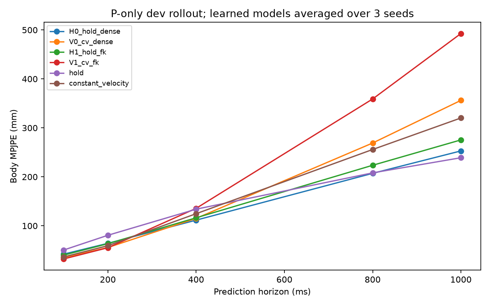

# P 常速度残差实验结果

三个种子全部完成；dev选模，holdout尚未使用。位置单位mm。

| 配置 | Body MPJPE均值±标准差 | PA-MPJPE | 统一体型MPJPE | 1秒自反馈MPJPE |
|---|---:|---:|---:|---:|
| H0_hold_dense | 42.102 ± 0.347 | 16.913 | 24.482 | 252.973 |
| V0_cv_dense | 35.939 ± 0.168 | 11.755 | 16.374 | 356.213 |
| H1_hold_fk | 39.892 ± 0.374 | 18.422 | 27.871 | 275.461 |
| V1_cv_fk | 33.317 ± 0.186 | 13.780 | 19.784 | 492.756 |
| hold | 50.358 | 19.274 | 34.229 | 239.051 |
| constant_velocity | 36.750 | 13.043 | 16.839 | 320.266 |

## 结论

- V0_cv_dense 相对 H0_hold_dense：Body MPJPE变化 -6.163 mm，take配对95%区间 [-8.010, -4.506]。
- V1_cv_fk 相对 H1_hold_fk：Body MPJPE变化 -6.576 mm，take配对95%区间 [-8.726, -4.764]。
- 候选 V1_cv_fk：Body MPJPE 33.317 mm，PA-MPJPE 13.780 mm，统一体型 19.784 mm；超过纯CV的跨种子/区间要求：未达到；35/15 mm工程目标：未达到。
- 候选相对纯CV的seed62/63/64差值：-3.381/-3.279/-3.641 mm。
- 候选200ms自反馈MPJPE 55.202 mm；相对配对保持残差组 -8.317 mm；该时长最强物理基线 59.419 mm。
- 候选400ms自反馈MPJPE 135.676 mm；相对配对保持残差组 +19.320 mm；该时长最强物理基线 124.728 mm。
- 候选1000ms自反馈MPJPE 492.756 mm；相对配对保持残差组 +217.294 mm；该时长最强物理基线 239.051 mm。
- 以上为dev选模结果；holdout尚未评估，尚未验证接入G的收益。

[详细结果与配对区间](summary.json)

