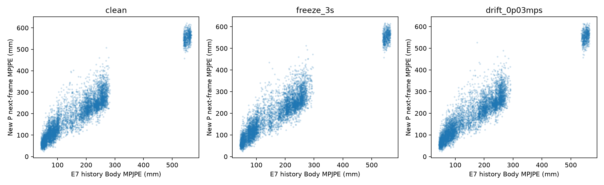

# 新P实际历史适应性结果

> 2026-09-29审计补充：本轮保留原E7权重，但修改了滑窗提交、地面、固定体型及坐标解码流程，尚未完成原流程同片段复现。以下数字仅描述该修改版流程，不能作为原E7官方成绩或单独归因于P。详见[流程差异审计](../../../docs/experiments/p-real-history.md)。

同一新P、相同dev与目标帧；三个P seed与三个E7 draw取均值。单位mm。

| 输入 | Body MPJPE | PA-MPJPE | 统一体型MPJPE | Body相对GT变化 |
|---|---:|---:|---:|---:|
| 原GT历史 | 34.099 | 10.552 | 14.054 | — |
| E7/clean | 213.535 | 66.087 | 210.949 | +179.436 |
| E7/freeze_3s | 214.560 | 68.116 | 211.772 | +180.462 |
| E7/drift_0p03mps | 215.065 | 66.555 | 212.454 | +180.966 |

## 结论

- clean：新P Body 213.535mm，原GT历史 34.099mm，变化+179.436mm（+526.2%），按take配对95%区间[+122.537,+257.145]；PA 66.087mm，统一体型 210.949mm。
- freeze_3s：新P Body 214.560mm，原GT历史 34.099mm，变化+180.462mm（+529.2%），按take配对95%区间[+123.776,+257.743]；PA 68.116mm，统一体型 211.772mm。
- drift_0p03mps：新P Body 215.065mm，原GT历史 34.099mm，变化+180.966mm（+530.7%），按take配对95%区间[+124.474,+257.987]；PA 66.555mm，统一体型 212.454mm。
- 本轮只量化同一个新P更换历史输入后的变化，没有重新训练或评估旧P/CV/Hold；不能据此判断预测历史上替代方法的优劣。
- 历史来源为冻结原E7的因果窗口推理；不是训练后G闭环，且dev已参与先前选模，holdout未使用。

[完整统计、时间子集及故障阶段](summary.json)

## 输入历史质量与结论边界

- 输入端诊断：clean的20帧E7历史自身平均Body187.205mm、根位置173.106mm、根相对70.140mm。历史本身误差很大；这些值对齐历史各自时刻GT，不能与下一帧分数相减后解释为P独自产生的误差。
- 排除startup混入后t40…199的P Body214.434mm；完整80帧E7窗口子集t100…199为218.379mm。大误差不是只发生在启动过渡。统一体型误差仍为210.949mm，单纯体型差异不足以解释退化。
- 结论：当前配置尚不能证明实际历史适应性。优先审计因果E7窗口输入、地面/坐标与历史重建质量，再决定是否进行train-only GT/预测历史混合适配；本轮不据此否定已验证的GT历史P收益，也不自动启动新训练。

[输入历史质量汇总](history_input_summary.json)
