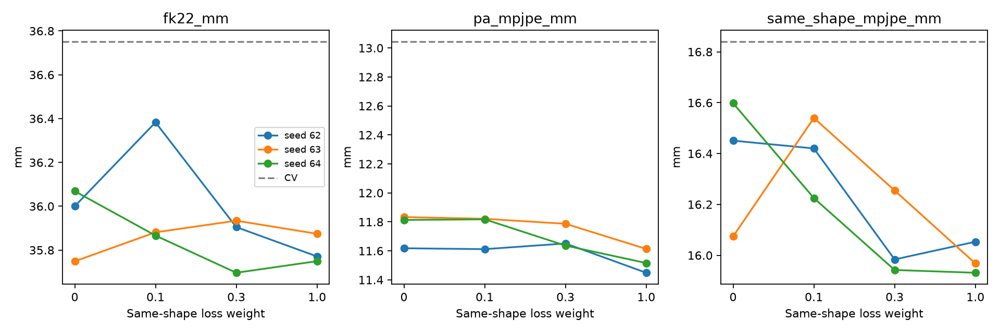

# P 统一体型FK监督实验结果

常速度残差，无显式速度；原FK损失=0，geometry=1。三个种子dev选模结果。

| 新损失权重 | Body MPJPE均值±标准差 | PA-MPJPE | 统一体型MPJPE | 局部旋转° |
|---|---:|---:|---:|---:|
| 0 | 35.939 ± 0.168 | 11.755 | 16.374 | 2.670 |
| 0.1 | 36.043 ± 0.294 | 11.750 | 16.395 | 2.749 |
| 0.3 | 35.845 ± 0.130 | 11.692 | 16.060 | 2.832 |
| 1 | 35.798 ± 0.067 | 11.526 | 15.984 | 3.018 |
| hold | 50.358 | 19.274 | 34.229 | 3.480 |
| constant_velocity | 36.750 | 13.043 | 16.839 | 2.647 |

位置单位mm。

## 结论

- 同体型权重0.1：Body MPJPE变化+0.104 mm，95%区间[-0.209, +0.414]；统一体型变化+0.021 mm；局部旋转变化+0.079°。
- 权重0.1的seed62/63/64正式MPJPE差值：+0.383/+0.132/-0.203 mm。
- 同体型权重0.3：Body MPJPE变化-0.094 mm，95%区间[-0.454, +0.211]；统一体型变化-0.314 mm；局部旋转变化+0.161°。
- 权重0.3的seed62/63/64正式MPJPE差值：-0.095/+0.185/-0.372 mm。
- 同体型权重1：Body MPJPE变化-0.141 mm，95%区间[-0.520, +0.183]；统一体型变化-0.390 mm；局部旋转变化+0.348°。
- 权重1的seed62/63/64正式MPJPE差值：-0.229/+0.125/-0.319 mm。
- 按三种子正式MPJPE选出的候选为pose10：Body 35.798 mm、PA 11.526 mm、统一体型 15.984 mm。
- 候选相对配对对照的各seed/区间改善要求：未达到；35/15 mm工程目标：未达到。
- 主指标始终对原始GT计算；纯P长程仅作诊断。dev用于checkpoint及三个权重的选择，区间未作多重比较校正，不能代替独立验证。
- holdout和接入G收益尚未验证；显式速度分支未启用。

[完整统计与辅助自反馈](summary.json)

