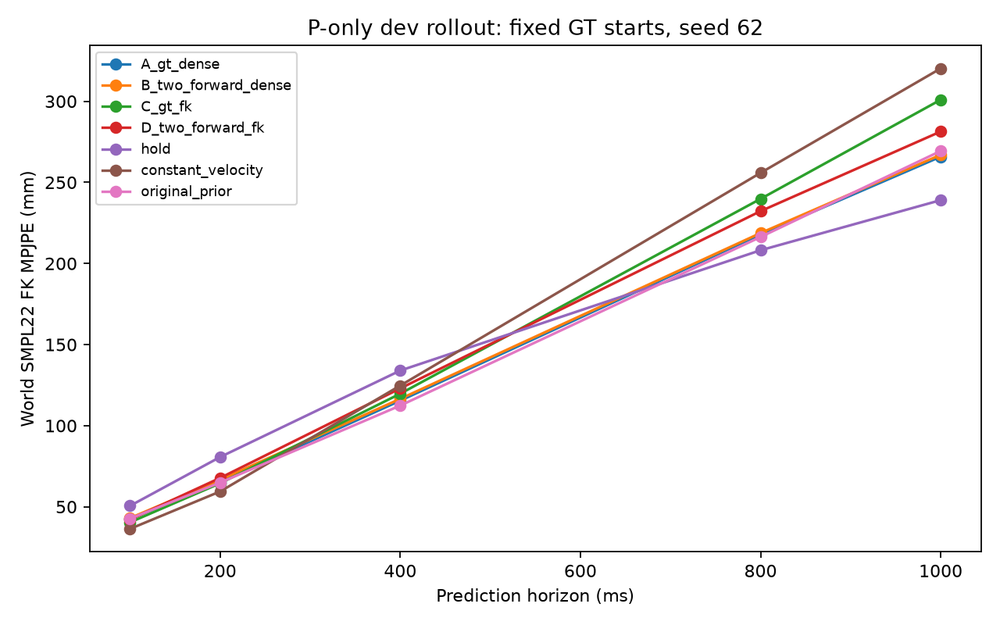
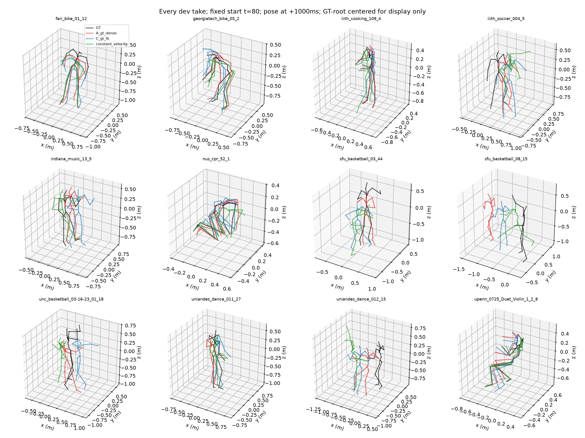

# 独立 P 改进实验结果

固定 train/dev 划分；dev 选模，holdout 未使用。

| 配置 | 下一帧 FK (mm) | 1 秒自反馈 FK (mm) |
|---|---:|---:|
| A_gt_dense_s62 | 42.246 | 265.880 |
| B_two_forward_dense_s62 | 43.276 | 267.015 |
| C_gt_fk_s62 | 40.321 | 300.967 |
| D_two_forward_fk_s62 | 41.771 | 281.364 |
| A_gt_dense_s63 | 41.707 | 237.220 |
| C_gt_fk_s63 | 39.634 | 262.359 |
| A_gt_dense_s64 | 42.353 | 255.818 |
| C_gt_fk_s64 | 39.721 | 263.057 |

## 实验结论

- seed62 下一帧 FK 相对 A 的变化：Two-Forward(B) +1.029 mm；FK监督(C) -1.925 mm；组合(D) -0.475 mm。负值表示改善。
- 候选 C_gt_fk 的种子复核：三个种子均降低下一帧误差；seed62/63/64 相对 A 分别为 -1.925/-2.072/-2.632 mm。
- 1秒自反馈相对 A 的变化（seed62/63/64）：+35.087/+25.139/+7.239 mm；正值表示自反馈退化。
- 候选三种子平均下一帧FK 39.892 mm；常速度基线 36.750 mm。以上是dev选模结果，尚未验证独立holdout或接入G后的收益。

