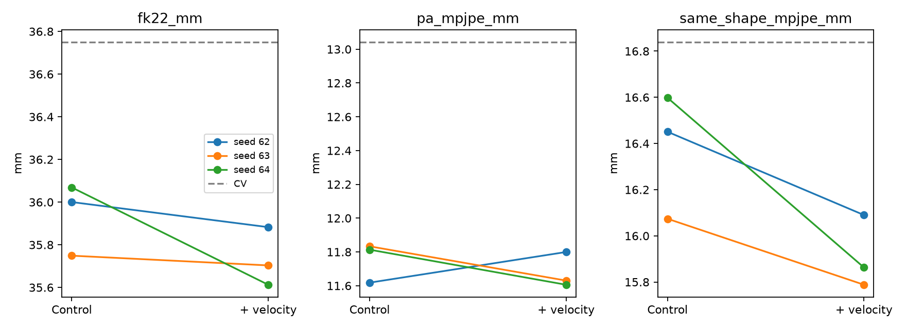

# 显式速度输入实验结果

常速度＋残差，geometry=1/FK=0；GT历史，三种子dev结果。位置单位mm。

| 方法 | Body MPJPE均值±标准差 | PA-MPJPE | 统一体型MPJPE | 1秒自反馈（辅助） |
|---|---:|---:|---:|---:|
| control | 35.939 ± 0.168 | 11.755 | 16.374 | 356.213 |
| velocity | 35.733 ± 0.137 | 11.679 | 15.914 | 356.729 |
| hold | 50.358 | 19.274 | 34.229 | 239.051 |
| constant_velocity | 36.750 | 13.043 | 16.839 | 320.266 |

## 结论

- 显式速度相对配对对照：Body MPJPE 35.939→35.733 mm，差值 -0.206 mm，take配对95%区间 [-0.457, +0.048]。
- seed62/63/64差值：-0.118/-0.046/-0.456 mm。
- PA-MPJPE 11.755→11.679 mm；统一体型 16.374→15.914 mm。
- 单步稳定改善要求（各seed均改善且配对区间低于0）：未达到。纯P长程只作辅助诊断，不作为本轮单独淘汰条件。
- 相对纯CV Body MPJPE差值 -1.018 mm；35/15 mm工程目标：未达到。
- dev参与选模；holdout、G预测历史上的单步适配及接入G收益尚未验证。

[完整指标、配对区间和计算量](summary.json)

